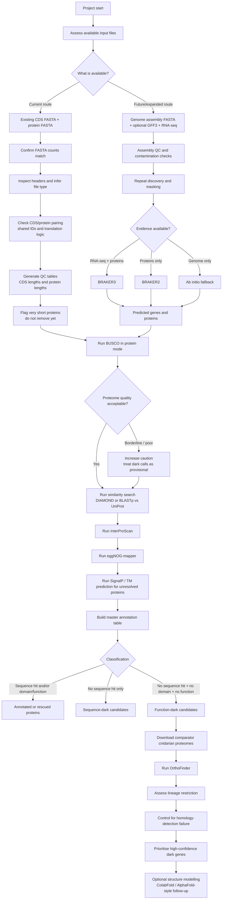

# project_dark_genes

Exploring and understanding how to identify novel **"dark" genes** in a non-model cnidarian dataset, using *Actinia equina* sequence resources and an HPC workflow.

## Current status

At the moment, the project is starting **from an existing paired CDS/protein gene set**, rather than from a raw genome assembly.

### Current files in hand
- `equina_smart.rnam-trna.merged.ggf.curated.remredun.nucl.fa`
- `equina_smart.rnam-trna.merged.ggf.curated.remredun.aa.fa`

### What has been established so far
- Both files contain **55,607** entries
- Headers match between files (example: `evm.utg4.1`)
- Mean protein length is **452.05 aa**
- Minimum protein length is **32 aa**
- Maximum protein length is **10,458 aa**

Interpretation so far:
- `nucl.fa` is currently being treated as **CDS/transcript-like nucleotide sequences**
- `aa.fa` is currently being treated as the corresponding **predicted proteome**
- The immediate workflow therefore begins with **proteome QC and functional annotation**

A task-by-task record is maintained in [PROJECT_TRACKER.md](PROJECT_TRACKER.md).

---

## Workflow overview

---

## What has been completed so far
- Defined the conceptual dark-gene analysis workflow for cnidarian genomes
- Adapted the workflow for an HPC-based single-species analysis
- Confirmed that chromosome-level assembly is not required to begin the project
- Determined that the currently available files are most likely an **existing EVM-like gene set** rather than a raw genome assembly
- Verified matching sequence counts between nucleotide and protein FASTA files
- Verified matching example headers between nucleotide and protein FASTA files
- Calculated first-pass protein length summary statistics
- Reframed phase 1 toward **gene-set QC**, rather than assembly repeat masking

---

## Immediate next steps
1. Confirm CDS/protein pairing rigorously using shared IDs and translation-length checks
2. Generate QC tables for CDS lengths and protein lengths
3. Flag short proteins for review
4. Run **BUSCO in protein mode**
5. Use BUSCO to decide how strict downstream filtering must be before dark-gene classification

---

## Information needed from BUSCO next
To continue to the annotation stage with confidence, record the following from the BUSCO run:

### Essential
- BUSCO version
- BUSCO mode (`proteins`)
- lineage dataset used
- short summary values:
  - Complete (C)
  - Single-copy (S)
  - Duplicated (D)
  - Fragmented (F)
  - Missing (M)
  - Total BUSCO groups searched (`n`)

### Very useful
- BUSCO output directory path
- `short_summary` text or JSON file
- `full_table.tsv`
- any warnings about duplication, fragmentation, or failed searches

BUSCO is the first major checkpoint because it tells us whether this proteome looks broadly complete, over-duplicated, fragmented, or suspiciously inflated. That directly changes how conservatively we should interpret proteins with no annotation.
