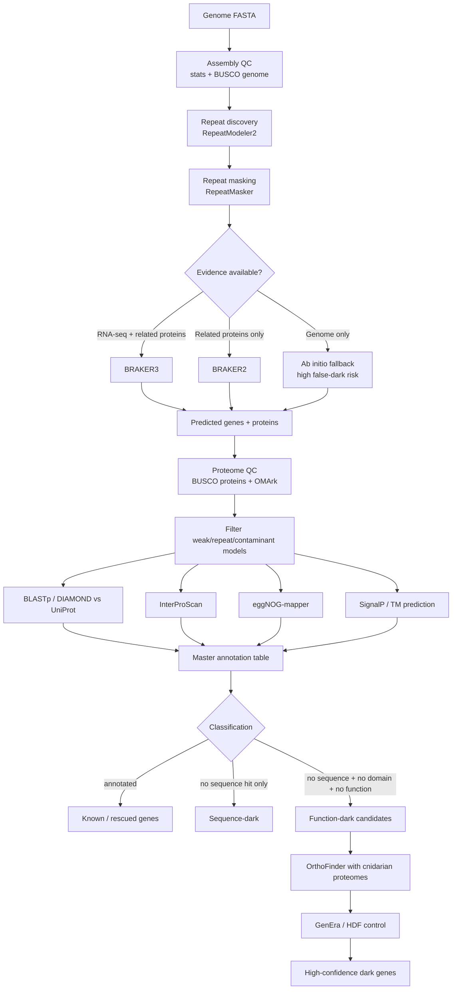

# project_dark_genes
Exploring and understanding how to identify novel "dark" genes in genomes in non-model species. using my Actinia equina RNA-seq data from my PhD and Dr Craig Wilding's (et al.)  genome scaffolds, nucleotide and amino acid fasta data files.

    W --> X[Structure modelling ColabFold / AlphaFold DB]
    X --> Y[Priority shortlist]
