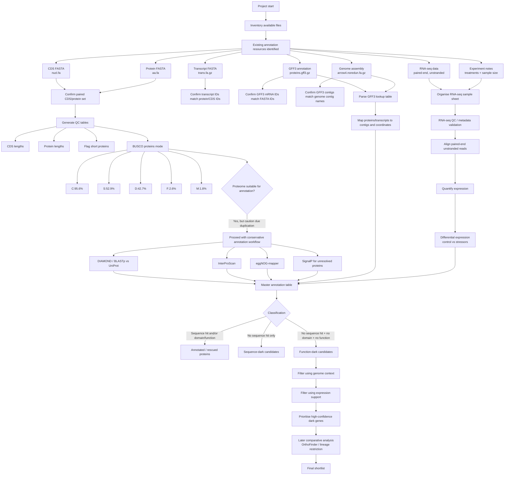

# project_dark_genes

Exploring and understanding how to identify novel **“dark” genes** in a non-model cnidarian dataset using *Actinia equina* sequence resources, genome annotation files, and RNA-seq data on an HPC workflow.

## Project aim

The goal of this project is to identify and prioritise **candidate dark genes** in *Actinia equina* by combining:

- an existing predicted gene/protein set
- genome assembly and GFF3 annotation
- functional annotation tools
- expression evidence from RNA-seq
- downstream comparative and validation steps

In this project, a **dark gene** is treated as a gene/protein that remains unresolved after layered annotation and quality control, rather than simply a sequence with “no BLAST hit”.

---

## Current project state

### Core input files currently available

- `equina_smart.rnam-trna.merged.ggf.curated.remredun.nucl.fa`
- `equina_smart.rnam-trna.merged.ggf.curated.remredun.aa.fa`
- `equina_smart.rnam-trna.merged.ggf.curated.remredun.trans.fa.gz`
- `equina_smart.rnam-trna.merged.ggf.curated.remredun.proteins.gff3.gz`
- `equina_smartden.arrow4.noredun.fa.gz`

### RNA-seq resources currently available

- paired-end RNA-seq data from a **multi-stressor experiment**
- includes **control treatments**
- libraries are **unstranded**
- experimental design notes are available in the `notes/` directory

### What has been established so far

- the nucleotide and amino acid FASTA files each contain **55,607** entries
- IDs match across the CDS/protein/transcript files, e.g. `evm.utg4.1`
- GFF3 `mRNA` IDs match the FASTA IDs
- GFF3 seqids match genome contig names
- mean protein length is **452.05 aa**
- protein length range is **32 aa** to **10,458 aa**
- the available data now support a **genome-aware and expression-aware dark-gene workflow**

---

## BUSCO checkpoint

BUSCO was run on the predicted proteome in **protein mode**.

### BUSCO run details

- **BUSCO version:** v5.3.2
- **mode:** proteins
- **lineage:** `metazoa_odb10`
- **output directory:** `/uoa/scratch/users/r02hw22/project_dark_genes/equina_busco_proteins`

### BUSCO summary

- **C:** 95.6%
- **S:** 52.9%
- **D:** 42.7%
- **F:** 2.6%
- **M:** 1.8%
- **n:** 954

Detailed counts:

- **912** complete BUSCOs
- **505** complete and single-copy
- **407** complete and duplicated
- **25** fragmented
- **17** missing

### Interpretation

The proteome appears **highly complete**, which supports downstream annotation and candidate dark-gene discovery.

However, the **high duplicated BUSCO fraction (42.7%)** suggests caution about:

- annotation redundancy
- retained isoforms
- haplotig-related duplication
- overprediction

This means downstream dark-gene classification should be **conservative**, particularly for:

- short proteins
- singletons
- low-support loci
- proteins lacking expression support

---

## What has been completed so far

- defined the conceptual dark-gene workflow for cnidarian genomes
- adapted the workflow for a single-species HPC implementation
- confirmed that chromosome-level assembly is **not required** to begin
- confirmed that the available FASTA files represent an existing **gene/protein set**
- verified ID consistency across CDS, protein, transcript, and GFF3 resources
- confirmed linkage between GFF3 coordinates and genome contigs
- generated basic QC summaries for the proteome
- flagged short proteins for later review
- completed a BUSCO checkpoint on the protein set
- identified RNA-seq resources for downstream validation and prioritisation

---

## Immediate next steps

### 1. Archive BUSCO outputs
- save `short_summary`
- inspect/copy `full_table.tsv`

### 2. Start functional annotation
- run **DIAMOND or BLASTp** against UniProt / reference proteomes
- run **InterProScan**
- run **eggNOG-mapper**
- run **SignalP** later for unresolved candidates

### 3. Build genome-aware lookup tables
- parse the GFF3 into a gene → transcript → protein → contig lookup table
- link candidate dark genes back to genomic coordinates
- summarise exon count, CDS span, transcript span, and scaffold location

### 4. Integrate RNA-seq evidence
- convert the experiment notes into a structured sample sheet
- align paired-end unstranded reads
- quantify expression
- identify expressed candidate dark genes
- test for differential expression between controls and stressor treatments

### 5. Build the master annotation table
For each gene/protein, integrate:

- length/QC information
- similarity search results
- InterPro domain results
- eggNOG annotation
- genomic context
- expression support
- differential expression status

---

## Current workflow overview

